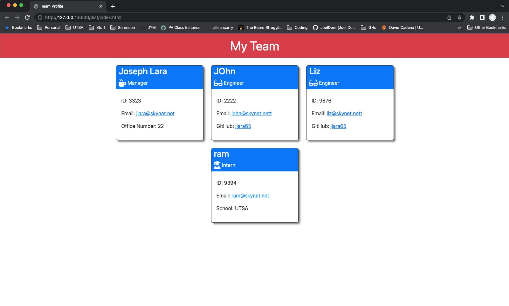

# team-profile-generator

## Description
Using command line application to generates a website to display the team employees.

## Table of Contents
* [Description](#Description)
* [Installation](#Installation)
* [Usage](#Usage)
* [Contributing](#Contributing)
* [Tests](#Tests)
* [Questions](#Questions)
* [License](#License)

## Installation 
Requires the npm Inquirer version 8.2.4 package:
```bash
npm install inquirer@8.2.4
```
## Usage
--> [Walkthrough Video](https://watch.screencastify.com/v/WfFKfGZVaFgL50VRW81j)<--

1. Run `node index` in terminal
2. Follow the prompts to build a employees team
3. A file name `index.html` will be generated in the dist folder



## Contributing
1. Fork this repository
2. Create a new branch
3. Commit changes on your branch
4. Push your changes
5. Create a new pull request

## Tests
Requires npm jest package to run tests:
```bash
npm run test
```

## Questions
If you have any question or would like to report the issues in this project, please feel free to contact me at email_to_be_annouced@domain.com

## License 
This project is license under the [MIT](./LICENSE)

&copy; 2022 Joseph Lara